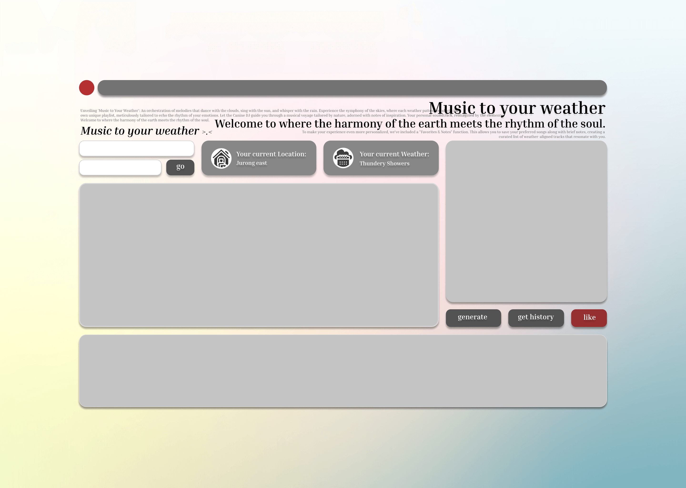

# Music To Your Weather
*Yes, there're tons of weather apps on the market.*

*But this might be one of the first apps to **match the music you listen to with the forecasted weather.***

## What's 'Music to Your Weather'?
### Inspirations
*Have you ever walked in the rain while thinking to yourself, "I wish there's some nice music for me to dance to"?*

*Or, do you keep coming back to that one fine Sunday morning, walking in the golden light of the rising sun with a nice cup of coffee in hand, but somehow you still sense the lack of some good melody?*

The inspiration for **Music to Your Weather (MTYW)** comes from such scenarios that everyone could resonate with. The Weather, to us human beings, is much more than the meteorological conditions, rather, varying weather conditions are inherently perceived by people from a subjective point of view and thus related to diffrent moods and feelings.

Starting with this observation, this web application offers to match music, a popular form of art creation to recreate scenes and feelings in the audience, with the forecasted weather.

Just launch the web app, and the matching song would pop-up to you with the latest weather forecast. So you know not only **if it's going to rain or not**, but you'll be confident that **you'll have the perfect song for that special moment in life.**

### Problem & Analysis
As stated in the ***inspiration*** section, this web app provides a tentative solution to the everyday scenario of finding suitable music for a given weather condition.

To properly match numerical/nominal weather data to music, which are described by numerical acoustic features, a proper algorithm would have to be developed and fine-tuned for satisfactory results - this is exactly where the innovations lie in this project and how we pushed the boundaries.

### Challenges
The team members are faced with two major challenges while implementing the project:
- where to source the raw data;
- how to translate data into usable results (in this case, embedded songs);

To source the core data for the project, we used two APIs in this web app:
- [**Weather Forecast**](https://beta.data.gov.sg/collections/1456/datasets/d_91ffc58263cff535910c16a4166ccbc3/view) APIs provided by SG government and openly accessible to all developers without registration:  
    - 2-hour Weather Forecast, 24-hour Weather Forecast & 4-day Weather Forecast are provided and can be used accordingly;
    - For 20hour Weather Forecast, readings from different meteorological observing stations are provided;
    - In this case, we use the **2-hour Weather Forecast**;
- [**Spotify Web API**](https://developer.spotify.com/documentation/web-api) provided by Spotify, which requires a one to be registered first and generate the token and secret for his application before proceeding:
    - In the research and algorithm design stage, this web app depends on [Get Track's Audio Feature](https://developer.spotify.com/documentation/web-api/reference/get-audio-features) to fetch key features of a given track to decide on the target range for diffrent features for different weather conditions;
    - In the implementation, this web app utilizes [Get Recommendations](https://developer.spotify.com/documentation/web-api/reference/get-recommendations) to fetch real-time recommendations for the forecasted weather condition;

In addition to that, we also developed a simple scrawler to fetch historical data from [Meteorological Service Singapore](http://www.weather.gov.sg/climate-historical-daily/) to so that our users can go back in time to find out about the weather and suggested song for that day.

To more intuitively show the forecasted weather, we also incorporated the [Google Map API](https://developers.google.com/maps/documentation/embed/get-started) into our project so that we can offer the user with a straightforward map display of weather conditions.

---

To tackle the second challenge, we collected a sample weather dataset and analyzed the features of the dataset. Eventually, we have come up with the following design that groups weather into 5 mood categories with their distinctive audio feature parameters to get the most relevant recommendations:

*In acutal implementation, for variety of recommendations, some parameters listed below may have been omitted.*

#### Matching Forecasted Weather (Nominal Data) to Spotify Recommendation
<table class="c11"><tbody><tr class="c15"><td class="c4 c16" colspan="1" rowspan="1">
Weather
</td><td class="c14 c16" colspan="1" rowspan="1">
Mood
</td><td class="c8 c16" colspan="1" rowspan="1">
Parameters
</td><td class="c17 c16" colspan="1" rowspan="1">
seed_genres
</td></tr><tr class="c9"><td class="c4" colspan="1" rowspan="1">
Fair (Day)
</td><td class="c14" colspan="1" rowspan="5">
Calm and Peaceful
</td><td class="c8" colspan="1" rowspan="5"><ul class="c19 lst-kix_m8w3a1jjewfy-0 start"><li class="c5 c6 li-bullet-0">Tempo:&nbsp;60-90 BPM</li><li class="c5 c6 li-bullet-0">Valence:&nbsp;0.6-0.9 (suggesting positive and uplifting feelings)</li><li class="c5 c6 li-bullet-0">Energy:&nbsp;0.2-0.4 (lower energy for relaxation)</li><li class="c5 c6 li-bullet-0">Acousticness:&nbsp;0.5-0.9 (favoring acoustic sounds)</li><li class="c5 c6 li-bullet-0">Instrumentalness:&nbsp;0.4-1.0 (ranging from mostly to fully instrumental)</li></ul></td><td class="c17" colspan="1" rowspan="5">
pop,dance,classical,hip-hop,folk
</td></tr><tr class="c9"><td class="c4" colspan="1" rowspan="1">
Fair (Night)
</td></tr><tr class="c9"><td class="c4" colspan="1" rowspan="1">
Fair and Warm
</td></tr><tr class="c9"><td class="c4" colspan="1" rowspan="1">
Partly Cloudy (Day)
</td></tr><tr class="c9"><td class="c4" colspan="1" rowspan="1">
Partly Cloudy (Night)
</td></tr><tr class="c9"><td class="c4" colspan="1" rowspan="1">
Cloudy
</td><td class="c14" colspan="1" rowspan="4">
Mysterious and Reflective
</td><td class="c8" colspan="1" rowspan="4"><ul class="c19 lst-kix_ayozs99sgoev-0 start"><li class="c5 c6 li-bullet-0">Tempo:&nbsp;70-100 BPM</li><li class="c5 c6 li-bullet-0">Valence:&nbsp;0.3-0.5 (conveying a more introspective or ambiguous mood)</li><li class="c5 c6 li-bullet-0">Energy:&nbsp;0.3-0.5 (subdued energy level)</li><li class="c5 c6 li-bullet-0">Acousticness:&nbsp;0.4-0.8 (a mix of electronic and acoustic sounds)</li><li class="c5 c6 li-bullet-0">Instrumentalness:&nbsp;0.2-0.8 (allowing for both vocal and instrumental tracks)</li></ul></td><td class="c17" colspan="1" rowspan="4">
pop,dance,classical,hip-hop,folk
</td></tr><tr class="c9"><td class="c4" colspan="1" rowspan="1">
Hazy
</td></tr><tr class="c9"><td class="c4" colspan="1" rowspan="1">
Slightly Hazy
</td></tr><tr class="c9"><td class="c4" colspan="1" rowspan="1">
Mist
</td></tr><tr class="c15"><td class="c4" colspan="1" rowspan="1">
Windy
</td><td class="c14" colspan="1" rowspan="1">
Energetic and Lively
</td><td class="c8" colspan="1" rowspan="1"><ul class="c19 lst-kix_9unu5jarg4jf-0 start"><li class="c5 c6 li-bullet-0">Tempo: 120-160 BPM</li><li class="c5 c6 li-bullet-0">Valence:&nbsp;0.7-1.0 (highly positive and energizing)</li><li class="c5 c6 li-bullet-0">Energy:&nbsp;0.7-1.0 (very high energy to match the lively atmosphere)</li><li class="c5 c6 li-bullet-0">Danceability:&nbsp;0.6-1.0 (promoting movement and dance)</li><li class="c5 c6 li-bullet-0">Acousticness:&nbsp;0.0-0.4 (more electronic and synthesized sounds)</li></ul></td><td class="c17" colspan="1" rowspan="1">
pop,dance,classical,hip-hop,rock
</td></tr><tr class="c9"><td class="c4" colspan="1" rowspan="1">
Light Rain
</td><td class="c14" colspan="1" rowspan="6">
Reflective and Somber
</td><td class="c8" colspan="1" rowspan="6"><ul class="c19 lst-kix_rw9n5z8or8yr-0 start"><li class="c5 c6 li-bullet-0">Tempo:&nbsp;60-90 BPM</li><li class="c5 c6 li-bullet-0">Valence:&nbsp;0.1-0.4 (lower valence for a somber or melancholic feel)</li><li class="c5 c6 li-bullet-0">Energy:&nbsp;0.2-0.5 (lower energy to reflect a subdued or reflective mood)</li><li class="c5 c6 li-bullet-0">Acousticness: 0.5-0.9 (strong presence of acoustic elements for depth)</li><li class="c5 c6 li-bullet-0">Instrumentalness:&nbsp;0.1-0.5 (to include some vocal tracks that convey emotion)</li></ul></td><td class="c17" colspan="1" rowspan="6">
rainy-day
</td></tr><tr class="c9"><td class="c4" colspan="1" rowspan="1">
Moderate Rain
</td></tr><tr class="c9"><td class="c4" colspan="1" rowspan="1">
Heavy Rain
</td></tr><tr class="c9"><td class="c4" colspan="1" rowspan="1">
Passing Showers
</td></tr><tr class="c9"><td class="c4" colspan="1" rowspan="1">
Light Showers
</td></tr><tr class="c9"><td class="c4" colspan="1" rowspan="1">
Showers
</td></tr><tr class="c9"><td class="c4" colspan="1" rowspan="1">
Heavy Showers
</td><td class="c14" colspan="1" rowspan="4">
Intense and Dramatic
</td><td class="c8" colspan="1" rowspan="4"><ul class="c19 lst-kix_9mf88x9ddus-0 start"><li class="c5 c6 li-bullet-0">Tempo: 80-140 BPM (a wider range to accommodate varying levels of intensity)</li><li class="c5 c6 li-bullet-0">Valence:&nbsp;0.1-0.3 (very low valence for dramatic and tense emotions)</li><li class="c5 c6 li-bullet-0">Energy:&nbsp;0.7-1.0 (high energy to reflect the dramatic and intense nature of the weather)</li><li class="c5 c6 li-bullet-0">Danceability:&nbsp;0.3-0.6 (not a focus, but can vary depending on the specific dramatic tone)</li><li class="c5 c6 li-bullet-0">Acousticness:&nbsp;0.0-0.5 (allowing for a mix of electronic and acoustic sounds to match the intensity)</li></ul></td><td class="c17" colspan="1" rowspan="4">
pop,dance,classical,hip-hop,rock
</td></tr><tr class="c9"><td class="c4" colspan="1" rowspan="1">
Thundery Showers
</td></tr><tr class="c9"><td class="c4" colspan="1" rowspan="1">
Heavy Thundery Showers
</td></tr><tr class="c9"><td class="c4" colspan="1" rowspan="1">
Heavy Thundery Showers with Gusty Winds
</td></tr></tbody></table>

#### Matching Historical Data to Spotify Recommendations
<table class="c11"><tbody><tr class="c15"><td class="c13" colspan="1" rowspan="1">
Mood
</td><td class="c21 c16" colspan="1" rowspan="1">
Weather Conditions
</td><td class="c18 c16" colspan="1" rowspan="1">
Audio Features
</td><td class="c13" colspan="1" rowspan="1">
Seed_Genres
</td></tr><tr class="c15"><td class="c28" colspan="1" rowspan="1">
Calm and Peaceful
</td><td class="c21" colspan="1" rowspan="1"><ul class="c19 lst-kix_m8w3a1jjewfy-0"><li class="c5 c10 li-bullet-0">Mean Wind Speed (km/h): Low (4.1 to 10.0) - Gentle breezes that are soothing and create a sense of tranquility.</li><li class="c5 c10 li-bullet-0">Daily Rainfall Total (mm): Very low (0.0 to 5.0) - Minimal to no rain, suggesting clear skies and peaceful conditions.</li><li class="c5 c10 li-bullet-0">Mean Temperature (°C): Moderate (25.0 to 28.0) - Comfortable temperatures that are neither too hot nor too cold.</li></ul></td><td class="c18" colspan="1" rowspan="1"><ul class="c19 lst-kix_m8w3a1jjewfy-0"><li class="c5 c6 li-bullet-0">Tempo:&nbsp;60-90 BPM</li><li class="c5 c6 li-bullet-0">Valence:&nbsp;0.6-0.9 (suggesting positive and uplifting feelings)</li><li class="c5 c6 li-bullet-0">Energy:&nbsp;0.2-0.4 (lower energy for relaxation)</li><li class="c5 c6 li-bullet-0">Acousticness:&nbsp;0.5-0.9 (favoring acoustic sounds)</li><li class="c5 c6 li-bullet-0">Instrumentalness:&nbsp;0.4-1.0 (ranging from mostly to fully instrumental)</li></ul></td><td class="c28" colspan="1" rowspan="1">
pop,dance,classical,hip-hop,folk
</td></tr><tr class="c15"><td class="c28" colspan="1" rowspan="1">
Mysterious and Reflective
</td><td class="c21" colspan="1" rowspan="1"><ul class="c19 lst-kix_4axgxett014j-0 start"><li class="c5 c10 li-bullet-0">Mean Temperature (°C): Slightly cool (22.8 to 24.0) - Cooler temperatures that may induce introspection or a reflective mood.</li><li class="c5 c10 li-bullet-0">Maximum Temperature (°C): Low peak (23.9 to 25.0) - Overcast days with limited sunlight, enhancing a mysterious ambiance.</li><li class="c5 c10 li-bullet-0">Mean Wind Speed (km/h): Moderate (10.1 to 15.0) - A breeze that's noticeable but not overpowering, adding to the atmosphere.</li></ul>

</td><td class="c18" colspan="1" rowspan="1"><ul class="c19 lst-kix_ayozs99sgoev-0"><li class="c5 c6 li-bullet-0">Tempo:&nbsp;70-100 BPM</li><li class="c5 c6 li-bullet-0">Valence:&nbsp;0.3-0.5 (conveying a more introspective or ambiguous mood)</li><li class="c5 c6 li-bullet-0">Energy:&nbsp;0.3-0.5 (subdued energy level)</li><li class="c5 c6 li-bullet-0">Acousticness:&nbsp;0.4-0.8 (a mix of electronic and acoustic sounds)</li><li class="c5 c6 li-bullet-0">Instrumentalness:&nbsp;0.2-0.8 (allowing for both vocal and instrumental tracks)</li></ul></td><td class="c28" colspan="1" rowspan="1">
pop,dance,classical,hip-hop,folk
</td></tr><tr class="c15"><td class="c28" colspan="1" rowspan="1">
Energetic and Lively
</td><td class="c21" colspan="1" rowspan="1"><ul class="c19 lst-kix_sklo4vmrr2jd-0 start"><li class="c5 c10 li-bullet-0">Maximum Temperature (°C): High (31.0 to 36.7) - Warmer days that are often associated with outdoor activities and vibrancy.</li><li class="c5 c10 li-bullet-0">Mean Wind Speed (km/h): Moderately high (15.1 to 20.0) - Stronger winds that can invigorate and energize individuals.</li></ul>

</td><td class="c18" colspan="1" rowspan="1"><ul class="c19 lst-kix_9unu5jarg4jf-0"><li class="c5 c6 li-bullet-0">Tempo: 120-160 BPM</li><li class="c5 c6 li-bullet-0">Valence:&nbsp;0.7-1.0 (highly positive and energizing)</li><li class="c5 c6 li-bullet-0">Energy:&nbsp;0.7-1.0 (very high energy to match the lively atmosphere)</li><li class="c5 c6 li-bullet-0">Danceability:&nbsp;0.6-1.0 (promoting movement and dance)</li><li class="c5 c6 li-bullet-0">Acousticness:&nbsp;0.0-0.4 (more electronic and synthesized sounds)</li></ul></td><td class="c28" colspan="1" rowspan="1">
pop,dance,classical,hip-hop,rock
</td></tr><tr class="c15"><td class="c28" colspan="1" rowspan="1">
Reflective and Somber
</td><td class="c21" colspan="1" rowspan="1"><ul class="c19 lst-kix_3tlgshk9lei5-0 start"><li class="c5 c10 li-bullet-0">Daily Rainfall Total (mm): Moderate (5.1 to 20.0) - Rainy days that often bring about contemplation and a somber mood.</li><li class="c5 c10 li-bullet-0">Minimum Temperature (°C): Cool nights (21.4 to 22.7) - Cooler temperatures that can induce a reflective state, especially at night.</li></ul>

</td><td class="c18" colspan="1" rowspan="1"><ul class="c19 lst-kix_rw9n5z8or8yr-0"><li class="c5 c6 li-bullet-0">Tempo:&nbsp;60-90 BPM</li><li class="c5 c6 li-bullet-0">Valence:&nbsp;0.1-0.4 (lower valence for a somber or melancholic feel)</li><li class="c5 c6 li-bullet-0">Energy:&nbsp;0.2-0.5 (lower energy to reflect a subdued or reflective mood)</li><li class="c5 c6 li-bullet-0">Acousticness: 0.5-0.9 (strong presence of acoustic elements for depth)</li><li class="c5 c6 li-bullet-0">Instrumentalness:&nbsp;0.1-0.5 (to include some vocal tracks that convey emotion)</li></ul></td><td class="c28" colspan="1" rowspan="1">
rainy-day
</td></tr><tr class="c15"><td class="c28" colspan="1" rowspan="1">
Intense and Dramatic
</td><td class="c21" colspan="1" rowspan="1"><ul class="c19 lst-kix_livm5fsjuemn-0 start"><li class="c5 c10 li-bullet-0">Daily Rainfall Total (mm): Very high (50.0 to 134.0) - Heavy rainfall that can create dramatic and intense weather conditions.</li><li class="c5 c10 li-bullet-0">Highest 60 Min Rainfall (mm): High (30.0 to 83.6) - Short bursts of intense rainfall adding to the drama.</li><li class="c5 c10 li-bullet-0">Max Wind Speed (km/h): Very high (50.0 to 77.0) - Strong wind gusts that can be exhilarating and create a sense of urgency.</li></ul>

</td><td class="c18" colspan="1" rowspan="1"><ul class="c19 lst-kix_9mf88x9ddus-0"><li class="c5 c6 li-bullet-0">Tempo: 80-140 BPM (a wider range to accommodate varying levels of intensity)</li><li class="c5 c6 li-bullet-0">Valence:&nbsp;0.1-0.3 (very low valence for dramatic and tense emotions)</li><li class="c5 c6 li-bullet-0">Energy:&nbsp;0.7-1.0 (high energy to reflect the dramatic and intense nature of the weather)</li><li class="c5 c6 li-bullet-0">Danceability:&nbsp;0.3-0.6 (not a focus, but can vary depending on the specific dramatic tone)</li><li class="c5 c6 li-bullet-0">Acousticness:&nbsp;0.0-0.5 (allowing for a mix of electronic and acoustic sounds to match the intensity)</li></ul></td><td class="c28" colspan="1" rowspan="1">
pop,dance,classical,hip-hop,rock
</td></tr></tbody></table>

### Significance of this Project

## Solution Architecture

### Prototype

### Front-end & Back-end Modules

## Competition Analysis
